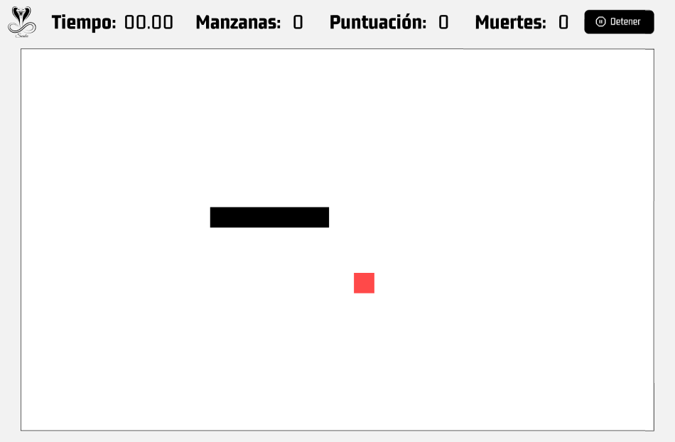

<div align="center">
    <a href="https://github.com/JheysonJhair/app_java_snake-game">
      
    </a>
    <h1>JhairDev - Snake</h1>
    <p align="center">
        Full Stack Developer Jhair
    </p>
</div>



# Juego en Java con Movimiento del Mouse

Bienvenido al **Juego en Java**, una aplicación diseñada para demostrar conocimientos sobre programación concurrente utilizando hilos. En este juego, el jugador controla un objeto que se mueve con el mouse, proporcionando una experiencia interactiva y dinámica.

## Tecnologías Utilizadas

- **Java**: Lenguaje principal utilizado para el desarrollo del juego.
- **Java Swing**: Biblioteca utilizada para la creación de la interfaz gráfica de usuario (GUI) y para la interacción con el mouse.
- **Hilos**: Implementación de programación concurrente para gestionar el movimiento del objeto y mejorar la fluidez del juego.

---

## Características del Juego

- **Movimiento del Mouse**: El jugador puede controlar el movimiento de un objeto en la pantalla utilizando el mouse.
- **Uso de Hilos**: La lógica del juego está implementada utilizando hilos para permitir una actualización continua y fluida de la interfaz.
- **Interacción**: Respuestas rápidas a los movimientos del mouse, mejorando la jugabilidad y la experiencia del usuario.

---

## Instalación

1. **Requisitos previos**:
   - Tener instalado **Java JDK 17** o superior.

2. **Clonar el repositorio**:
   ```bash
   git clone https://github.com/JheysonJhair/app_java_snake-game.git
   cd app_java_snake-game
